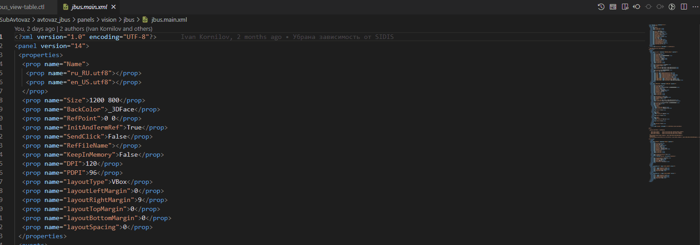
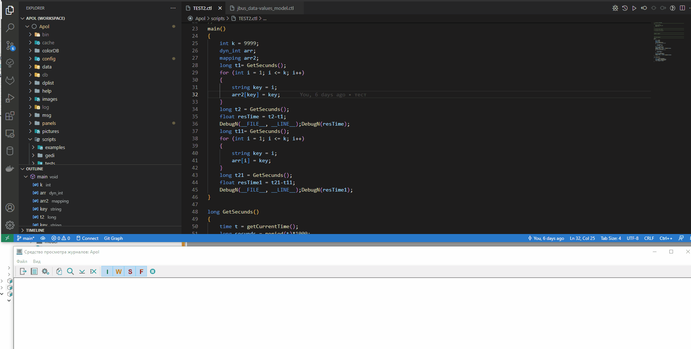
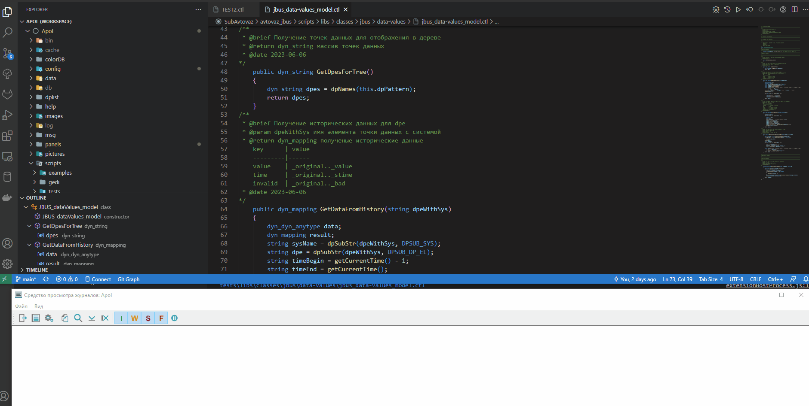
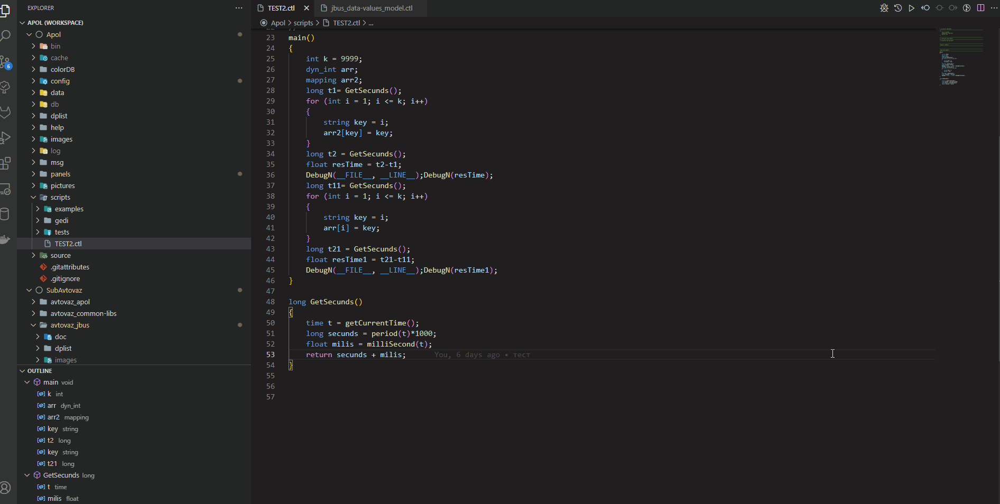
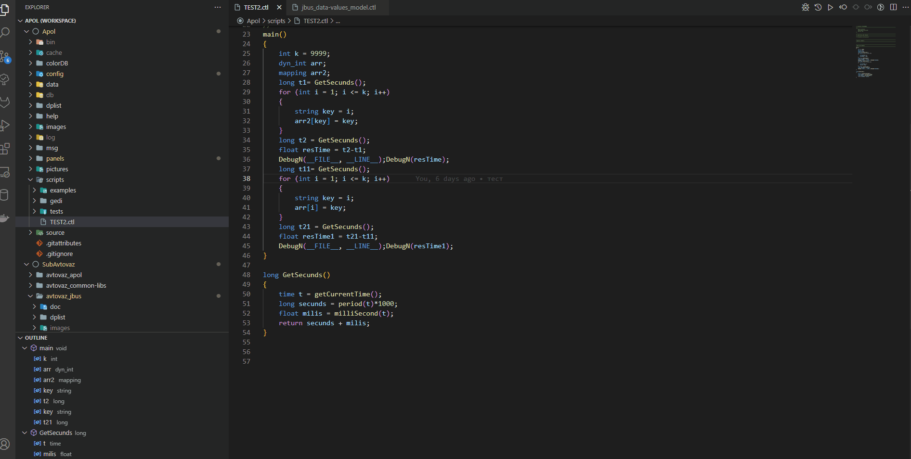

# wincc_tool
Расширение для VSCode. В настройках прописать пользователь пароль. Открыть папку с проектом, конфиг файл проекта считываетя автоматически.
## Основные команды:
- **Open panel** - открыть панель. Есть иконка сверху
- **Panelpreview** - посмотреть код панели

- **RunScript** - запуск скрипта
- **CheckScript** - проверить скрипт, вызывается приложение WCCOActrl.exe, которое отображает в логах строку с ошибкой если таковая имеется. Есть иконка сверху

  Помимо этого, если создан юнит тест для скрипта, **CheckScript** запускает его

- **OpenLogs** - создает output канал который отображает логи. Для большего удобства рекомендуется установить расширение https://marketplace.visualstudio.com/items?itemName=IBM.output-colorizer

- **OpenProjectPanel** - открытие панели командой

